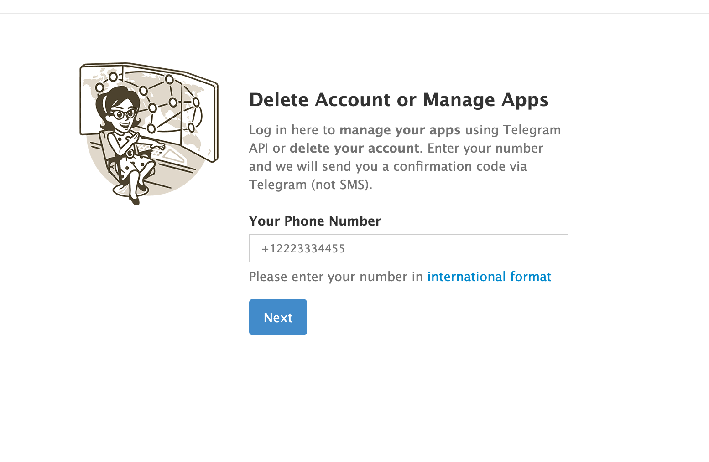
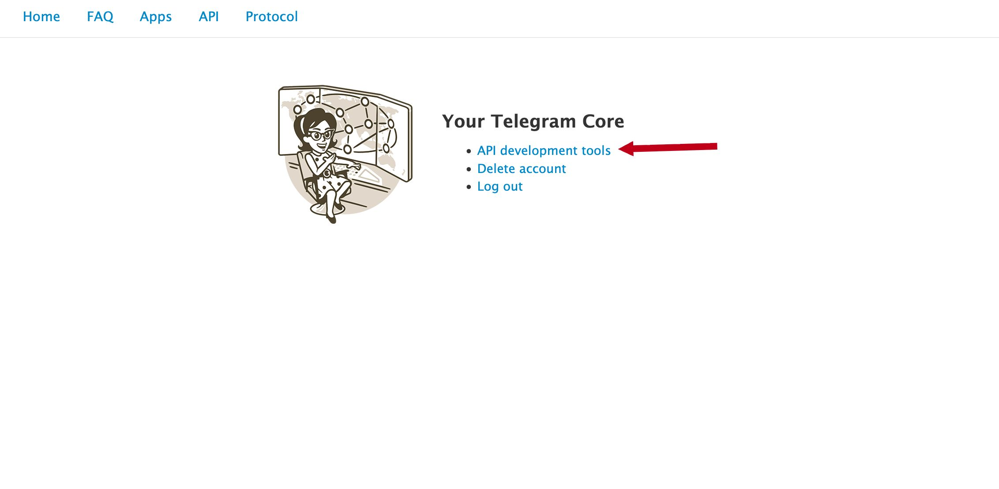
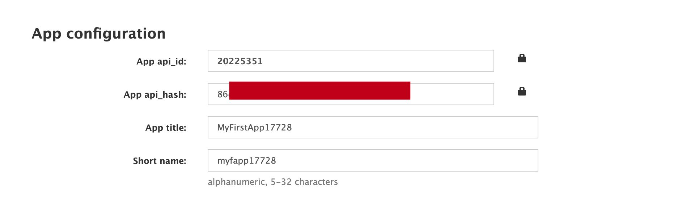

# Пользовательская Инструкция

## Для чего нужен бот

Бот помогает перенести сообщения из Telegram в eXpress.

Через него можно:

- подключить свою Telegram-учетную запись;
- посмотреть доступные Telegram-чаты;
- перенести один чат;
- запустить массовый перенос;
- повторить перенос или дозалить неуспешные сообщения;
- добавить пользователей в уже созданный чат через Excel;
- импортировать чат из Telegram export archive без Telethon.

## Важные термины

- `source_chat_id` — идентификатор исходного Telegram-чата. Его можно получить через `/chats`.
- `target chat` — чат, который бот создает или использует в eXpress для переноса.
- `partial migration` — перенос без части участников, если их нельзя автоматически сопоставить.

## Что Подготовить До Старта Работ

Для работы через Telethon нужен не только доступ к боту, но и отдельная Telegram-учетная запись, от имени которой сервис будет читать чаты.

### 1. Подготовить Telegram-учетную запись

Рекомендуется использовать отдельную рабочую учетную запись, а не личный повседневный аккаунт.

Что важно для этой учетной записи:

- она должна иметь доступ к тем Telegram-чатам, которые планируется переносить;
- если нужно читать старую историю, аккаунт должен реально видеть эту историю в Telegram;
- если включен пароль 2FA, держи его под рукой для команды `/connect`;
- если это групповой или канальный перенос, аккаунт должен иметь достаточные права для чтения участников и истории.

### 2. Создать Telegram application для Telethon

Telethon работает через Telegram API, поэтому нужен `api_id` и `api_hash`.

Как получить их:

1. Открой `https://my.telegram.org`.
2. Войди под номером той Telegram-учетной записи, которую будешь подключать к боту.

3. Перейди в раздел [`API development tools`](https://my.telegram.org/apps).

4. Создай приложение.


Что обычно нужно заполнить:

- `App title` — любое понятное имя, например `ExpressMigrationBot`;
- `Short name` — короткое латинское имя без пробелов, например `expressmigratebot`.

После сохранения Telegram покажет:

- `App api_id`
- `App api_hash`

Именно эти значения нужны для использования в переменных окружения. 
p.s. Эти параметры нужно запросить единожды, все остальные пользователи
будут использовать только номер телефона уже в самом боте

### 3. Передать параметры в инфраструктуру

Оператору стенда или DevOps нужно передать:

- `EXTG_TELEGRAM__API_ID`
- `EXTG_TELEGRAM__API_HASH`

Без этих параметров бот не сможет установить Telethon-сессию.

Важно:

- `api_hash` — секрет, его нельзя публиковать в чатах, wiki и тикетах без защищенного канала;
- `api_id` и `api_hash` привязаны к Telegram application и должны храниться так же аккуратно, как пароль;
- если приложение или учетная запись меняются, Telethon-подключение нужно перепроверить заново.

### 4. Проверить готовность перед первым `/connect`

Перед началом убедись, что:

- `api_id` и `api_hash` уже добавлены в окружение сервиса;
- нужная Telegram-учетная запись может войти в Telegram с телефона или desktop-клиента;
- у тебя есть доступ к SMS/Telegram-коду подтверждения;
- если включен 2FA, известен пароль;
- аккаунт уже добавлен в нужные исходные чаты и видит ту историю, которую нужно переносить.

### 5. Если Telethon использовать нельзя

Если нет возможности заводить Telegram application или подключать пользовательскую сессию, используй альтернативный сценарий:

```text
/import_archive
```

Этот режим работает по Telegram export archive и не требует Telethon, но у него есть ограничения:

- участники не добавляются;
- вложения не переносятся;
- это отдельный импортный сценарий, а не полноценный live-доступ к Telegram.

## Быстрый Старт

1. Подключи Telegram:
   `/connect +79990001122`
2. Проверь, что сессия подключена:
   `/account`
3. Посмотри список доступных чатов:
   `/chats`
4. Выбери нужный `source_chat_id`.
5. Запусти перенос:
   `/migrate <source_chat_id>`
6. Следи за прогрессом:
   `/status <source_chat_id>`

## Основные Сценарии

### 1. Подключить Telegram

Команда:

```text
/connect +79990001122
```

Что будет дальше:

- бот запросит код из Telegram;
- если на аккаунте включен 2FA, бот попросит пароль;
- после этого учетная запись будет привязана только к тебе.

Перед этим шагом должны быть уже настроены `EXTG_TELEGRAM__API_ID` и `EXTG_TELEGRAM__API_HASH`.

Проверить подключение:

```text
/account
```

Отключить учетную запись:

```text
/disconnect
```

### 2. Посмотреть доступные чаты

Команда:

```text
/chats
```

Полезные варианты:

```text
/chats query=project
/chats limit=50
```

Что покажет бот:

- `source_chat_id`
- тип чата
- название
- был ли чат уже настроен
- есть ли уже прогресс по переносу

### 3. Посмотреть пользователей чата

Команда:

```text
/chat_users <source_chat_id>
```

Используй ее, если нужно заранее понять:

- кого бот уже умеет сопоставлять с eXpress;
- для кого понадобится ручной маппинг;
- кого потом придется добавлять вручную.

### 4. Настроить чат перед переносом

Если команду вызвать без опций, бот просто покажет текущую конфигурацию:

```text
/configure <source_chat_id>
```

Примеры настройки:

```text
/configure <source_chat_id> access=link
/configure <source_chat_id> media=off
/configure <source_chat_id> format=quote
/configure <source_chat_id> from=2026-01-01T00:00:00+03:00 to=2026-03-01T00:00:00+03:00
```

Что обычно настраивают:

- `access=invite|link` — как выдавать доступ к результату;
- `media=on|off` — переносить ли вложения;
- `format=quote|source_id|none` — формат ссылок/ответов;
- `from` / `to` — ограничение диапазона сообщений.

### 5. Перенести один чат

Команда:

```text
/migrate <source_chat_id>
```

Что может произойти во время переноса:

- если это personal chat, бот может попросить указать второго участника через mention, email или `huid`;
- если это group/channel, бот может прислать Excel-файл для сопоставления участников;
- если часть людей не сопоставлена, можно отправить `/skip` и продолжить partial migration;
- если нужно остановить wizard или задачу, можно использовать `/cancel`.

Полезные варианты:

```text
/migrate <source_chat_id> batch=200
/migrate <source_chat_id> progress=resume
/migrate <source_chat_id> target_title="Новый чат"
```

### 6. Перенести все чаты

Команда:

```text
/migrate_all
```

Что делает команда:

- берет все доступные Telegram-чаты;
- автоматически создает недостающие конфигурации;
- запускает перенос по каждому чату отдельной фоновой задачей.

Что важно:

- по умолчанию для автосозданного конфига используется `access=link`;
- если для конкретного чата нужны дополнительные действия, бот сам остановится на нужном шаге;
- массовый перенос не отменяет того, что одним и тем же чатом управляет только его владелец.

### 7. Добавить пользователей в уже мигрированный чат

Команда:

```text
/add_users
```

или сразу для конкретного чата:

```text
/add_users <source_chat_id>
```

Как работает flow:

1. бот покажет список уже мигрированных чатов или сразу подготовит Excel;
2. ты заполняешь файл и загружаешь его обратно;
3. бот добавляет пользователей в существующий target chat.

Какие колонки можно заполнить:

- `target_huid`
- `corporate_email`
- `ad_login`
- `other_id`

Если заполнено несколько, используется приоритет:

1. `target_huid`
2. `corporate_email`
3. `ad_login`
4. `other_id`

Важно:

- можно добавлять и новых пользователей, которых не было в Telegram-чате;
- для этого Telegram-поля можно оставить пустыми и заполнить только корпоративный идентификатор.

### 8. Импортировать Telegram export archive без Telethon

Команда:

```text
/import_archive
```

Что нужно сделать:

1. экспортировать чат из Telegram;
2. отправить боту архив `.json`, `.zip` или `.rar`.

Что сделает бот:

- создаст target chat;
- назначит инициатора администратором;
- перенесет только текстовые сообщения.

Ограничения этого режима:

- участники не добавляются;
- вложения не переносятся;
- это отдельный сценарий для случаев, когда не хочется работать через Telethon.

### 9. Повторить перенос или дозалить ошибки

Повторить перенос чата:

```text
/remigrate <source_chat_id>
```

Повторить только неуспешные элементы:

```text
/retry_failed
/retry_failed <source_chat_id>
/retry_failed <source_chat_id> limit=100 batch=50
```

Используй эти команды, если:

- перенос уже запускался;
- часть сообщений или вложений не дошла;
- нужно аккуратно продолжить без старта с нуля.

### 10. Проверить прогресс

Статус по одному чату:

```text
/status <source_chat_id>
```

Общий статус:

```text
/status
```

Общая статистика:

```text
/stats
```

Когда использовать:

- понять, есть ли активные фоновые задачи;
- посмотреть, сколько сообщений импортировано;
- увидеть, есть ли failed / ambiguous / processing хвосты.

### 11. Остановить работу

Отменить все свои активные задачи:

```text
/cancel
```

Отменить только один чат:

```text
/cancel <source_chat_id>
```

Что делает команда:

- останавливает активный wizard;
- снимает queued-задачи;
- для running-задач запрашивает остановку.

После отмены лучше через несколько секунд проверить:

```text
/status
```

## Справочник Команд

| Команда | Для чего | Пример |
| --- | --- | --- |
| `/help` | Показать список команд | `/help` |
| `/connect [PHONE]` | Подключить свою Telegram-учетную запись | `/connect +79990001122` |
| `/account` | Проверить Telegram-сессию | `/account` |
| `/disconnect` | Отключить свою Telegram-сессию | `/disconnect` |
| `/chats [query=TEXT] [limit=N]` | Посмотреть доступные Telegram-чаты | `/chats query=finance limit=30` |
| `/chat_users <source_chat_id>` | Посмотреть пользователей одного Telegram-чата | `/chat_users -1001234567890` |
| `/configure <source_chat_id> ...` | Показать или изменить конфигурацию переноса | `/configure -1001234567890 media=off access=link` |
| `/migrate <source_chat_id>` | Запустить перенос одного чата | `/migrate -1001234567890` |
| `/migrate_all` | Запустить перенос всех доступных чатов | `/migrate_all` |
| `/remigrate <source_chat_id>` | Повторить перенос чата | `/remigrate -1001234567890` |
| `/retry_failed [source_chat_id] [limit=N] [batch=N]` | Повторить только неуспешные элементы | `/retry_failed -1001234567890 limit=50 batch=25` |
| `/add_users [source_chat_id]` | Добавить пользователей в уже созданный чат через Excel | `/add_users -1001234567890` |
| `/import_archive` | Импортировать Telegram export archive | `/import_archive` |
| `/map_identity ...` | Сохранить ручное соответствие между Telegram и eXpress | `/map_identity tg_id=123456 email=user@company.ru` |
| `/status [source_chat_id]` | Посмотреть статус переноса | `/status -1001234567890` |
| `/stats` | Посмотреть общую статистику | `/stats` |
| `/cancel [source_chat_id]` | Остановить все свои задачи или один чат | `/cancel -1001234567890` |

## Ручное Сопоставление Пользователя

Если бот не смог автоматически сопоставить человека из Telegram с eXpress, можно помочь ему вручную:

```text
/map_identity tg_id=123456789 email=user@company.ru
```

или:

```text
/map_identity username=nickname email=user@company.ru
```

Эту команду удобно использовать:

- до запуска миграции;
- после `/chat_users`;
- если в wizard видно, что пользователь не распознан.

## Что Делать В Типовых Ситуациях

### Бот прислал Excel-файл

- заполни файл;
- загрузи его обратно тем же диалогом;
- если хочешь продолжить без нераспознанных людей, используй `/skip`, когда бот это предлагает.

### Хочу перенести чат без Telethon

- используй `/import_archive`;
- загрузи `.json`, `.zip` или `.rar` экспорт из Telegram.

### Хочу только добавить людей в уже созданный чат

- используй `/add_users`;
- не запускай для этого новый `/migrate`.

### Перенос идет слишком долго

Проверь:

```text
/status
/status <source_chat_id>
/stats
```

Если нужно:

- повтори только ошибки через `/retry_failed`;
- останови конкретный чат через `/cancel <source_chat_id>`;
- останови все свои активные задачи через `/cancel`.

## Ограничения И Практические Замечания

- Один и тот же исходный чат может быть закреплен только за первым оператором, который начал с ним работать.
- Пользователь видит и управляет только своими миграциями и своей Telegram-сессией.
- В archive-flow участники и вложения не переносятся.
- В некоторых сценариях бот специально переводит процесс в wizard, чтобы ты подтвердил доступ, участников или способ сопоставления.
